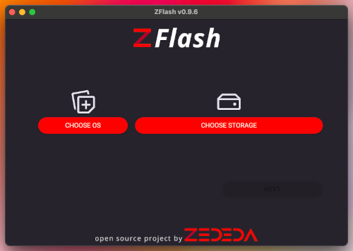

# ZFlash: Zededa's All-in-One Flash Tool for Seamless EVE-OS Deployment

ZFlash is a user-friendly tool for flashing EVE-OS images to your devices. It simplifies the process of downloading, verifying, and flashing EVE-OS, getting you up and running in minutes. ZFlash is a fork of the popular Raspberry Pi Imager, tailored for the EVE-OS community. In addition, it can be used for general image flashing for use-cases beyond EVE-OS. 

## Features

* **Effortless Image Selection**: Easily choose EVE-OS LTS images directly from our official GitHub repository.
* **Automatic Downloads & Verification**: ZFlash handles the entire process of downloading and verifying your selected image, ensuring integrity and saving you time.
* **Flexible Flashing Options**: Flash various image files from your local machine, providing versatile ways to manage your EVE-OS images.

---

## Getting Started

### Installation

ZFlash is available for **Windows**, **macOS**, and **Linux**. You can download the latest binaries from our [GitHub Releases page](https://github.com/zededa/zflash/releases).

> #### Note for macOS and Windows Users
> The macOS and Windows applications are not currently signed. This means you will need to accept security exceptions when installing and running the application for the first time.

## How to Use

1.  **Choose an Operating System**:
    * Click on **CHOOSE OS**.
    * You can select from the list of available EVE-OS LTS images.
    * Alternatively, you can choose 'Use custom' to select a custom image file from your computer. ZFlash supports both uncompressed disk images and several compressed formats:

    | File Extension | Type                | Description                                                                    |
    | :------------- | :------------------ | :----------------------------------------------------------------------------- |
    | `*.raw`        | Disk Image          | A raw, bit-for-bit copy of a disk.                                             |
    | `*.img`        | Disk Image          | Essentially the same as `.raw`, a common extension for disk images.            |
    | `*.wic`        | Disk Image          | A disk image format from the Yocto Project, common in embedded systems.        |
    | `*.zip`        | Compressed Archive  | Standard ZIP archive format.                                                   |
    | `*.gz`         | Compressed Archive  | Standard Gzip single-file compression format.                                  |
    | `*.xz`         | Compressed Archive  | A single-file compression format offering high compression ratios.             |
    | `*.zst`        | Compressed Archive  | A modern, fast single-file compression format with high compression ratios.    |

2.  **Choose Storage**:
    * Click on **CHOOSE STORAGE**.
    * Select the USB drive or SD card you want to flash the image to.

3.  **Write the Image**:
    * Click on **NEXT** to start the flashing process.
    * ZFlash will handle the download (if you selected an EVE-OS image), verification, and flashing.

---

## Connecting to a Different ZEDEDA Cluster

By default, the EVE-OS images downloaded by ZFlash are configured to connect to the `zedcloud.zededa.net` cluster. If you need to connect to a different cluster, you can do so using the text-based UI on the EVE node itself. This requires a keyboard and monitor connected to the EVE device.

---

## For Developers

For information on how to build ZFlash from source, and other developer-related documentation, please see our [DEVELOPER.md](DEVELOPER.md) file.

---

## License

This project is licensed under the Apache License 2.0 - see the [LICENSE](license.txt) file for details.